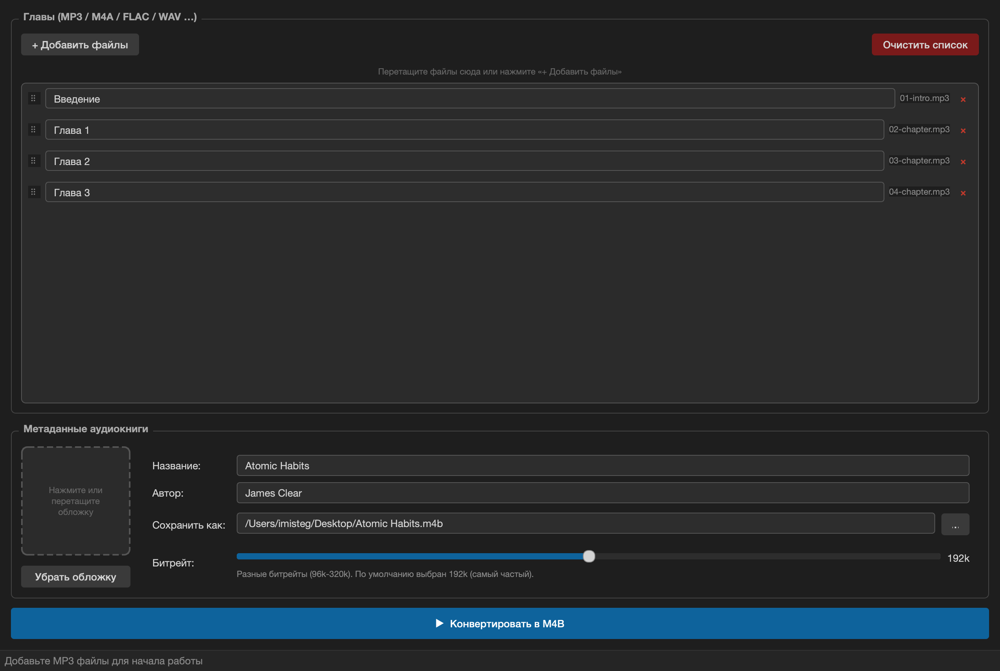

# AudioBook Maker

[](https://github.com/AleksanderTolstopyatov/book-converter/actions/workflows/ci.yml)
[](https://github.com/AleksanderTolstopyatov/book-converter/releases)
[](LICENSE)

Конвертирует набор MP3/M4A/FLAC/WAV файлов в одну аудиокнигу M4B с главами, обложкой и метаданными.  
Нативно открывается в **Apple Books** и **Podcasts** на iPhone/iPad без дополнительных приложений.

## Возможности

- Добавление файлов через кнопку или **drag-and-drop**
- Изменение **порядка глав** перетаскиванием
- Переименование **названий глав**
- Выбор **обложки** (JPG/PNG/WEBP)
- Поля: название, автор, путь сохранения
- Настройка битрейта и прогресс-бар конвертации
- Тёмная тема
- Работает на **macOS / Windows / Linux**

## Скриншоты

### Главное окно



## Требования

| Зависимость | Установка |
|---|---|
| Python 3.11+ | python.org |
| ffmpeg | `brew install ffmpeg` / `winget install ffmpeg` / `apt install ffmpeg` |
| PySide6 | `pip install PySide6` |
| mutagen | `pip install mutagen` |
| Pillow | `pip install Pillow` |

## Быстрый старт

```bash
# 1. Установить ffmpeg (один раз)
brew install ffmpeg          # macOS
# winget install ffmpeg      # Windows

# 2. Создать виртуальное окружение
python3 -m venv .venv
source .venv/bin/activate    # macOS/Linux
# .venv\Scripts\activate     # Windows

# 3. Установить Python-зависимости
pip install -r requirements.txt

# 4. Запустить
python main.py
```

## Запуск в venv (разные ОС)

### macOS / Linux

```bash
python3 -m venv .venv
source .venv/bin/activate
pip install -r requirements.txt
python main.py
```

### Windows (PowerShell)

```powershell
py -m venv .venv
.venv\Scripts\Activate.ps1
pip install -r requirements.txt
python main.py
```

### Windows (cmd)

```bat
py -m venv .venv
.venv\Scripts\activate.bat
pip install -r requirements.txt
python main.py
```

Для выхода из окружения на любой системе:

```bash
deactivate
```

## Структура проекта

```
books/
├── .github/
│   └── workflows/
│       ├── ci.yml       — проверка синтаксиса + сборка на каждый push/PR
│       └── release.yml  — публикация релиза при создании тега v*.*.*
├── main.py          — главное окно (UI)
├── widgets.py       — список глав с drag-and-drop
├── converter.py     — конвертация через ffmpeg (в отдельном потоке)
├── build.py         — скрипт сборки PyInstaller (встраивает ffmpeg)
└── requirements.txt
```

## Формат вывода

Файл `.m4b` (MPEG-4 Audiobook) — стандартный формат аудиокниг Apple.  
Содержит: AAC аудио + именованные главы + обложка + метаданные ID3.

## Сборка standalone (ffmpeg внутри — без внешних зависимостей)

```bash
pip install pyinstaller
python build.py
```

`build.py` автоматически найдёт `ffmpeg` и `ffprobe` и встроит их в бинарник.

| Платформа | Результат |
|---|---|
| macOS | `dist/AudioBook Maker.app` |
| Windows | `dist/AudioBook Maker.exe` |
| Linux | `dist/AudioBook Maker` |

Пользователю устанавливать ничего не нужно — ffmpeg уже внутри.

## Публикация релиза

```bash
# Создать тег — автоматически запустится release.yml
git tag v1.0.0
git push origin v1.0.0
```

GitHub Actions соберёт бинарники под macOS, Windows и Linux и опубликует их
в [Releases](https://github.com/AleksanderTolstopyatov/book-converter/releases) с описанием и таблицей скачивания.
